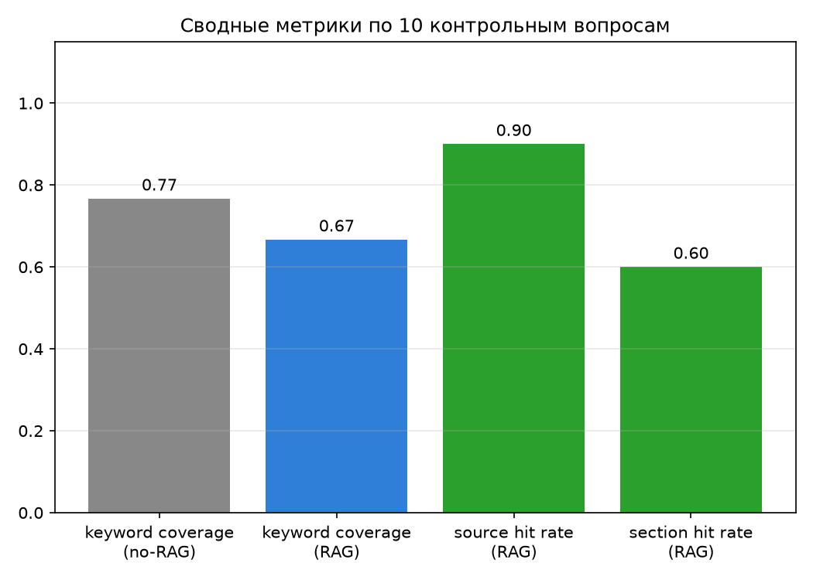
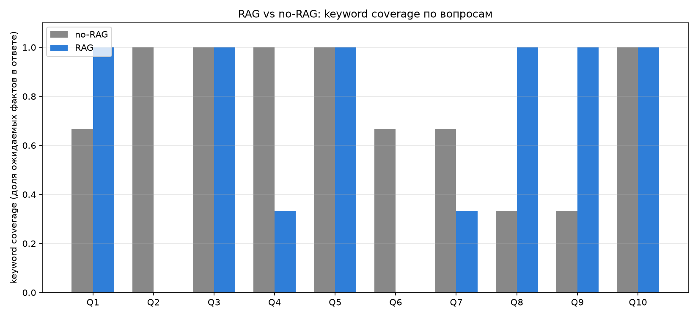

# Агент с двумя режимами: RAG vs no-RAG

Функция «вопрос → поиск релевантных чанков → объединение с вопросом →
запрос к LLM» поверх индекса, собранного в [d21](../d21). Сравнение
качества ответов с RAG и без него на 10 контрольных вопросах.

## Стек

- **Индекс**: переиспользуется из `d21/data/index/structure.*` (structure-
  based chunking, показал лучшее качество поиска в d21). Здесь заново
  ничего не индексируется.
- **Эмбеддинг запроса**: тот же локальный `nomic-embed-text` через Ollama.
- **LLM**: Claude (`claude-haiku-4-5`) через Anthropic API, ключ в `.env`.

## Запуск

```bash
python -m venv .venv && source .venv/bin/activate
pip install -r requirements.txt
# .env с ANTHROPIC_API_KEY / CLAUDE_API_KEY
# Ollama должна быть запущена (brew services start ollama) с моделью nomic-embed-text

python cli.py          # интерактивный чат: вопрос -> ответ без RAG и с RAG рядом
python run_eval.py     # прогон 10 контрольных вопросов, метрики -> results.json
python visualize.py    # графики сравнения -> results_plots/*.png
```

## Как работает функция RAG ([rag.py](rag.py))

```
question
  -> embed_query()               # эмбеддинг вопроса через Ollama
  -> FAISS search (top-5)        # релевантные чанки из d21/data/index
  -> build_context()             # чанки -> "[i] source=... section=...\ntext"
  -> user_msg = f"Контекст:\n{context}\n\nВопрос: {question}"
  -> Claude API (system просит отвечать только по контексту и указывать источники)
```

Режим `no_rag` — тот же вызов Claude API, но без контекста, просто вопрос.

## 10 контрольных вопросов

См. [questions.json](questions.json). Для каждого вопроса зафиксированы:
`expected_keywords` (что должно быть в ответе), `expected_sources` /
`expected_sections` (какой документ/раздел должен быть использован в RAG-
режиме). Вопросы покрывают все 3 документа корпуса и разные разделы.

## Метрики

- **keyword_coverage** — доля `expected_keywords`, найденных в тексте
  ответа (простой substring-матчинг, без embedding-сравнения)
- **source_hit / section_hit** (только RAG) — попал ли хотя бы один
  retrieved-чанк в ожидаемый документ/раздел

## Результаты (10 вопросов, `results.json`, графики в `results_plots/`)

| метрика | no-RAG | RAG |
|---|---|---|
| keyword coverage (среднее) | 0.68 | 0.62 |
| source hit rate | — | 0.90 |
| section hit rate | — | 0.60 |
| средняя latency | 3.5 сек | 3.1 сек |
| средние input tokens | 76 | 1392 |
| средние output tokens | 285 | 302 |




### Главный вывод — не тот, что ожидался

По формальной метрике keyword coverage RAG **не выигрывает** у no-RAG
(0.62 vs 0.68). Причина не в том, что RAG хуже — а в том, что все три
документа корпуса это *известные публичные статьи с arXiv* (RAG-статья
Lewis et al. 2020, два survey), которые модель, скорее всего, уже видела
на претрейне. No-RAG отвечает по памяти и часто попадает в те же самые
формулировки/термины, которые я взял как эталонные ключевые слова.

Разбор конкретных проседаний RAG-режима показал два разных механизма:

1. **Retrieval miss** (вопрос 2 — "какой retriever/generator использует
   оригинальная RAG-статья"): top-5 чанков вытащили общие сравнения
   retriever/generator из обзорных статей, а не конкретный раздел
   `2.2 Retriever: DPR` / `2.3 Generator: BART` из статьи Lewis et al.
   Чистая проблема качества поиска, а не генерации.

2. **Честный отказ вместо галлюцинации** (вопросы 6, 10): в system-
   промпте RAG явно запрещено придумывать факты, которых нет в
   контексте. Когда retrieved-чанк не содержал нужного перечисления
   (например, полный список "quality scores/required abilities"),
   модель написала "в контексте этого нет" — и получила 0 по
   keyword_coverage, хотя это *правильное* поведение. No-RAG в этой
   ситуации молча ответил по памяти и попал в термины.

При этом `source_hit_rate = 0.90` — в 9 из 10 случаев RAG всё-таки нашёл
чанк из правильного документа. И RAG — единственный режим, где вообще
можно проверить, на основании чего дан ответ (`section_hit_rate = 0.60`,
плюс явные ссылки `[source, section]` в самом тексте ответа); у no-RAG
такой проверки нет в принципе — он может так же уверенно рассказывать
и про документ, которого никогда не видел.

**Практический вывод**: на корпусе из широко известных публичных статей
разница в фактической точности между RAG и no-RAG будет казаться меньше,
чем можно ожидать — сильная модель и так помнит контент. Реальное
преимущество RAG проявляется на приватных/малоизвестных документах (где
у no-RAG попросту нет знаний) и в **проверяемости** ответа: RAG может
сослаться на источник и отказаться отвечать, если факта нет в контексте,
а no-RAG — нет.

## Структура проекта

```
rag.py             — retrieve + build_context + call_llm (оба режима)
cli.py              — интерактивный чат
questions.json      — 10 контрольных вопросов с ожиданиями
run_eval.py         — прогон вопросов, метрики -> results.json
visualize.py        — графики -> results_plots/*.png
results.json         — полные ответы + метрики по каждому вопросу
results_plots/       — per_question.png, summary.png, latency.png
```
