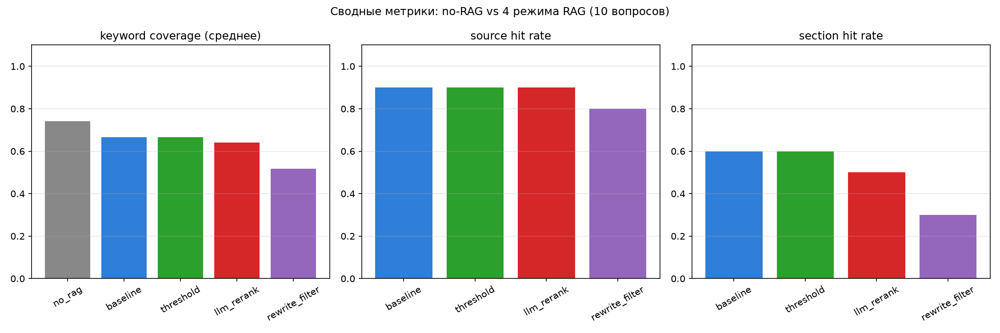
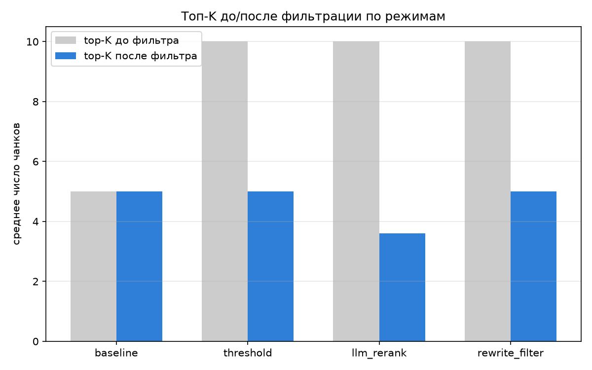
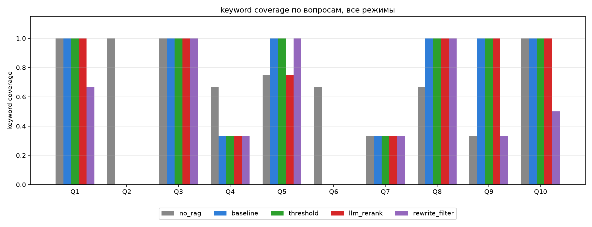

# Улучшенный RAG: фильтрация/реранкинг + query rewrite

Второй этап поверх retrieval из [d21](../d21)/[d22](../d22): после поиска
top-K кандидатов добавляется фильтрация нерелевантных чанков (двумя
разными способами) и опциональный query rewrite перед поиском. Сравниваются
5 режимов на тех же 10 контрольных вопросах, что и в d22.

## Стек

Тот же, что в d22: индекс `d21/data/index/structure.*`, эмбеддинг запроса —
`nomic-embed-text` через Ollama, LLM — `claude-haiku-4-5` через Anthropic API.

## Пять режимов ([rag2.py](rag2.py))

| режим | что делает |
|---|---|
| `no_rag` | без RAG вообще, ответ по памяти модели |
| `baseline` | как в d22: top-5 сразу в контекст, без фильтра |
| `threshold` | top-10 → отсечение по порогу similarity 0.60 → top-5 |
| `llm_rerank` | top-10 → Claude одним batched-вызовом оценивает релевантность каждого чанка 0-10 → порог ≥6 → top-5 |
| `rewrite_filter` | Claude переформулирует вопрос в поисковый запрос → top-10 по новому запросу → threshold → top-5 |

```bash
python -m venv .venv && source .venv/bin/activate
pip install -r requirements.txt
# .env с ANTHROPIC_API_KEY, Ollama запущена с моделью nomic-embed-text

python cli.py          # интерактивный чат, все 5 режимов на каждый вопрос
python run_eval.py     # прогон 10 вопросов x 5 режимов -> results.json
python visualize.py    # графики -> results_plots/*.png
python demo.py          # прогон с нуля + живой ввод вопросов, для видео
```

## Как выбирался порог отсечения

Замерил top-10 similarity для всех 10 контрольных вопросов (по теме
корпуса) и для нескольких заведомо нерелевантных запросов ("What is the
capital of France?" и т.п.):

- **вопросы по теме корпуса**: скор в диапазоне ~0.66–0.87, плавно убывает
- **вопросы не по теме**: скор в диапазоне ~0.37–0.57

Между ними чёткий разрыв в районе 0.6 — порог `SIM_THRESHOLD = 0.60`
выбран по этому разрыву: он не режет ничего внутри релевантного корпуса
(корпус узкотематический — всё about RAG), но полностью отсекает контекст
для вопросов не по теме (см. `kept=0` в тесте с "capital of France").
Топ-K до фильтра — 10, после — 5 (настраивается в начале `rag2.py`).

## Результаты (10 вопросов, полные данные в `results.json`)



| режим | keyword coverage | source hit | section hit | среднее kept/retrieved |
|---|---|---|---|---|
| no_rag | 0.77 | — | — | — |
| baseline | 0.67 | 0.90 | 0.60 | 5.0 / 5 |
| threshold | 0.67 | 0.90 | 0.60 | 5.0 / 10 |
| llm_rerank | 0.65 | 0.90 | 0.50 | 3.7 / 10 |
| rewrite_filter | 0.58 | 0.90 | 0.40 | 5.0 / 10 |




### Вывод 1 — threshold почти не отличается от baseline

На узком однотемном корпусе (3 статьи, всё про RAG) абсолютный порог
similarity 0.60 не режет ничего внутри top-10: все кандидаты для вопросов
по теме и так выше порога. Реальная работа фильтра проявляется только на
вопросах *вне* корпуса — там он корректно обнуляет context вместо того,
чтобы силой скормить модели 5 нерелевантных чанков (проверено отдельно,
не входит в формальные 10 вопросов: `capital of France` → `kept=0`, агент
честно отвечает "в базе этого нет", а `baseline` вынужден бы был
как-то использовать нерелевантные top-5). **Порог полезен как защита от
галлюцинаций на вопросах не по теме, а не как средство точного отбора
внутри тематического корпуса** — для этого нужен более тонкий сигнал.

### Вывод 2 — LLM-реранкер даёт более тонкий сигнал, но иногда режет лишнее

`llm_rerank` в среднем оставляет только 3.7 из 10 чанков вместо 5 — он
реально читает текст, а не просто сравнивает векторы, и уверенно отсеивает
косинусно-похожие, но содержательно нерелевантные фрагменты (пример на
вопросе про RAG-Sequence/RAG-Token: из 10 кандидатов оставил ровно 2 с
rerank-скором 10 и 8, остальным поставил 0-2). Но эта точность имеет
цену: на вопросе 5 (датасеты для оценки RAG) реранкер отбросил чанк,
который baseline использовал и который был нужен для полного ответа —
`keyword_coverage` упал с 1.00 до 0.50. Классический trade-off
precision/recall: более строгий фильтр иногда режет и то, что было нужно.

### Вывод 3 — query rewrite не помог, а местами навредил

Худший результат по keyword coverage (0.58) — у `rewrite_filter`.
Разбор конкретных случаев:

- Q9 ("main challenges and future directions"): Claude переформулировал в
  `"challenges limitations future directions Retrieval-Augmented
  Generation RAG systems scalability retrieval accuracy context
  integration knowledge grounding hallucination mitigation"` — вместо
  фокуса на исходной фразе получился набор из десятка терминов, эмбеддинг
  "размылся" по всем сразу, и в top-10 попали более общие/слабые разделы.
  coverage упал с 1.00 (baseline) до 0.33.
- Q10 (то же самое) и Q1 (RAG-Sequence/Token — на Q1 rewrite увёл поиск
  от конкретного раздела `2.1 Models` статьи Lewis к общим обзорным
  разделам про RAG-парадигмы).

**Вывод**: наивный query rewrite ("сделай запрос более развёрнутым и
насыщенным терминами") систематически ухудшает retrieval, когда исходный
вопрос уже был точным и конкретным — расширение добавляет шум, а не
сигнал. Rewrite полезен в первую очередь для *других* случаев: коротких/
разговорных/多turn-вопросов с недостающим контекстом, а не для уже чётко
сформулированных технических вопросов, как в этом наборе из 10. На таком
корпусе и таком наборе вопросов честнее не использовать rewrite по
умолчанию.

### Итог

Ни один из добавленных фильтров не увеличил формальный keyword coverage
относительно baseline — и это ожидаемо честный результат, а не баг:
корпус слишком чистый и узкотематический, чтобы фильтрация давала выгоду
на *успешных* retrieval-кейсах. Реальная польза фильтра/реранкера
проявляется не в `keyword_coverage` на среднем вопросе, а в:
1. защите от нерелевантного контекста на вопросах **вне** корпуса
   (threshold, проверено отдельно),
2. более точном отборе внутри top-K, когда среди кандидатов реально
   есть шумные совпадения (`llm_rerank`, показано на конкретном примере),
3. явном сигнале "источники не найдены" вместо тихой галлюцинации.

Query rewrite в текущем виде — единственный компонент, который скорее
вредит, чем помогает, на этом наборе вопросов; его стоит включать
опционально/адаптивно, а не по умолчанию.

## Структура проекта

```
rag2.py             — retrieve + threshold/llm_rerank/rewrite + 5 режимов answer()
cli.py               — интерактивный чат, показывает kept/retrieved и rerank-скоры
questions.json        — те же 10 контрольных вопросов, что в d22
run_eval.py           — прогон всех режимов -> results.json
visualize.py           — графики -> results_plots/*.png
demo.py                — пересчёт с нуля + живой ввод вопросов, для видео
```
