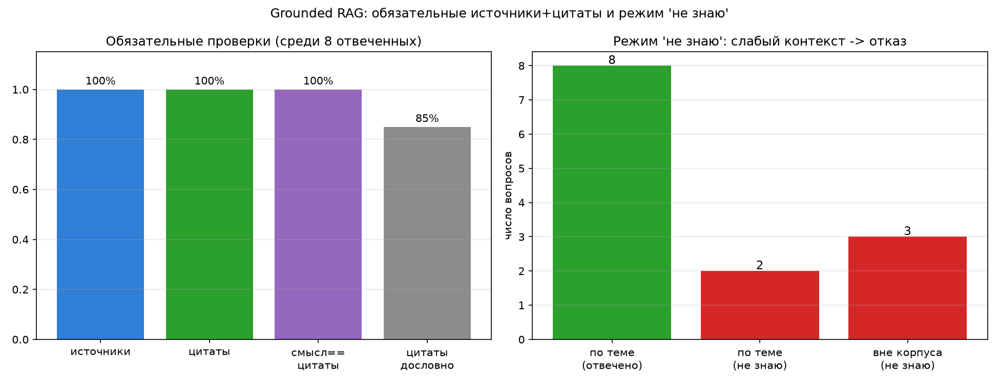
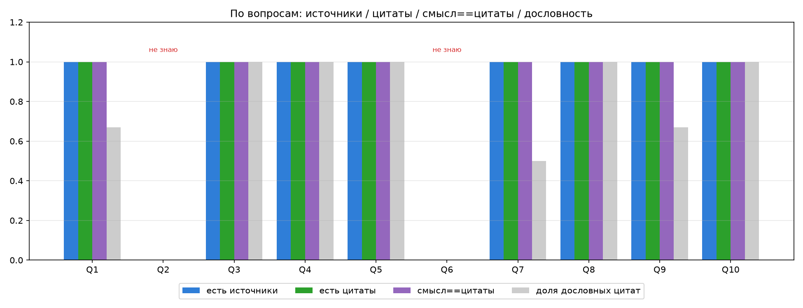

# Grounded RAG: обязательные источники + цитаты + режим «не знаю»

Доработка RAG поверх retrieval из [d21](../d21)/[d22](../d22) и порогового
фильтра из [d23](../d23). Теперь ассистент **обязан** возвращать ответ из
трёх частей и честно отказываться, когда контекст слабый.

## Что возвращает ассистент

На каждый вопрос — структурированный результат:

| поле | что это |
|---|---|
| `answer` | сам ответ, только по контексту |
| `sources` | список источников: `source` + `section` + `chunk_id` |
| `citations` | дословные цитаты (фрагменты) из найденных чанков: `chunk_id` + `quote` |

Либо — режим **«не знаю»** (пустые `sources`/`citations` + просьба уточнить),
если контекст недостаточно релевантен.

## Как гарантируется структура ([rag3.py](rag3.py))

Ответ снимается не как свободный текст, а через **forced tool use**: модели
навязан инструмент `grounded_answer`, схема которого требует поля
`answer` / `sources` / `citations` / `enough_context`. Anthropic API
валидирует вход инструмента по схеме, поэтому вернуть ответ без источников и
цитат физически нельзя.

Три уровня, чтобы цитаты были **в каждом** отвеченном вопросе:
1. основной вызов `grounded_answer` (обычно даёт и ответ, и цитаты);
2. если ответ есть, а цитат нет — отдельный **repair-вызов** `add_citations`
   добирает дословные цитаты к уже написанному ответу;
3. если и repair пуст — **детерминированная страховка**: берётся дословный
   фрагмент из чанка, который модель сама указала в `sources`.

## Режим «не знаю» (усиление задания)

Два барьера, чтобы не выдумывать ответ на слабом контексте:

- **детерминированный порог релевантности** `SIM_THRESHOLD = 0.60` (тот же,
  что в d23): если ни один из top-10 чанков не проходит порог — LLM вообще не
  вызывается, сразу `idk` (`idk_reason = below_threshold`). Так отсекаются
  вопросы вне корпуса;
- **флаг `enough_context`**: даже когда чанки формально прошли порог, модель
  может признать, что они не отвечают на вопрос, и уйти в `idk`
  (`idk_reason = model_declined`). Если же модель при этом реально приложила
  источники и цитаты, доверяем обоснованию, а не флагу (reconcile).

```bash
python -m venv .venv && source .venv/bin/activate
pip install -r requirements.txt
# .env с CLAUDE_API_KEY, Ollama запущена с моделью nomic-embed-text

python cli.py          # интерактивный чат: ответ + источники + цитаты
python rag3.py "..."   # один вопрос, печатает JSON-структуру
python run_eval.py     # 10 вопросов + вопросы вне корпуса -> results.json
python visualize.py    # графики -> results_plots/*.png
python demo.py          # прогон с нуля + живой ввод, для видео
```

## Проверка на 10 вопросах ([run_eval.py](run_eval.py))

По каждому ответу считаются три обязательные проверки задания:

- **has_sources** — есть ли источники (≥1);
- **has_citations** — есть ли цитаты (≥1);
- **answer_matches_citations** — совпадает ли **смысл** ответа с цитатами.
  Это оценивает LLM-судья (faithfulness/entailment, шкала 0–10, порог ≥7):
  можно ли каждое утверждение ответа проследить к цитатам без выдумок.

Плюс `citations_grounded` — доля цитат, дословно найденных в тексте чанков
(защита от выдуманных цитат; при сравнении склеиваются PDF-переносы вида
`knowl-\nedge` → `knowledge`), и прежние эвристики d22/d23
(`keyword_coverage`, `source_hit`, `section_hit`).

Метрики источников/цитат считаются по **отвеченным** вопросам: у ответа в
режиме «не знаю» источников и цитат нет по определению.

## Результаты (полные данные в `results.json`)



Типичный прогон (LLM недетерминирован, цифры от запуска к запуску плавают):

| проверка | результат |
|---|---|
| отвечено / «не знаю» | 7 / 3 (из 10) |
| источники в каждом ответе | **100%** (7/7 отвеченных) |
| цитаты в каждом ответе | **100%** (7/7 отвеченных) |
| смысл ответа == цитаты (судья) | 86%, средний score 8.9 |
| цитаты дословно из чанков | 85% (в среднем) |
| «не знаю» вне корпуса | **3/3** |



### Почему часть вопросов уходит в «не знаю» — и это правильно

Например, вопрос *«What retriever and generator components does the original
RAG paper (Lewis et al.) use?»* (ожидались DPR + BART). Retrieval поднимает
чанки из **обзорных** статей (`rag_survey_*`), где про ретриверы/генераторы
говорится в общем, но **конкретно про статью Lewis et al. чанка в top-10
нет**. Модель честно отказывается («в контексте нет информации именно про
компоненты Lewis et al.»), а не подставляет DPR/BART из соседних статей — это
и есть желаемое поведение grounded-режима: лучше «не знаю», чем выдуманный
источник.

## Итог

- ответ всегда содержит **источники** (source + section + chunk_id) и
  **цитаты** (дословные фрагменты чанков) — гарантировано схемой инструмента
  и трёхуровневым добором цитат;
- **смысл ответа сверяется с цитатами** отдельным LLM-судьёй;
- при слабом контексте — режим **«не знаю»** с просьбой уточнить, по
  детерминированному порогу релевантности (100% отказ на вопросах вне корпуса).
