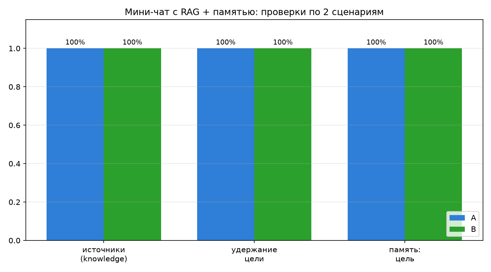
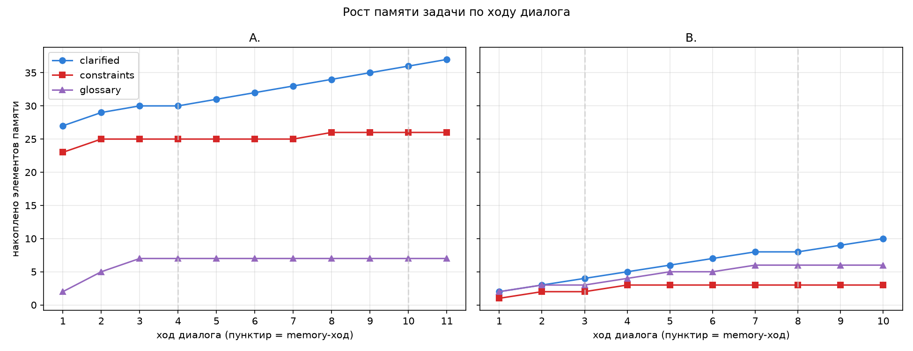

# Мини-чат с RAG + памятью задачи (production-like)

Многоходовый чат поверх grounded-RAG из [d24](../d24). На каждый ход ищет
контекст в базе, отвечает с учётом найденного и **всегда выводит источники**, а
также ведёт «память задачи» (task state), чтобы не терять цель диалога.

## Что делает ([chat.py](chat.py))

`ChatSession` хранит:
- **историю диалога** (`self.history`) — последние реплики передаются модели;
- **память задачи** (`self.task_state`): `goal`, `clarified`, `constraints`,
  `glossary` (зафиксированные термины), `open_questions`.

Каждый ход `ask(user_msg)`:
1. **обновляет память задачи** — LLM (forced tool `update_task_state`) по
   прошлой памяти + новой реплике возвращает обновлённое состояние;
2. **контекстуализирует запрос** — follow-up вроде «а какая из них гибче?»
   переписывается в самостоятельный поисковый запрос с учётом истории и цели;
3. **ищет контекст** — поиск идёт по **двум** запросам (переписанному и
   исходной реплике) с объединением кандидатов по `chunk_id`, затем пороговый
   фильтр `SIM_THRESHOLD = 0.60` (как в d24);
4. если контекст слабый → честный режим **«не знаю»**;
5. иначе **grounded-ответ** с учётом памяти задачи и истории, forced tool
   `grounded_reply` гарантирует наличие поля `sources`.

## Память задачи (усиление)

Память накапливается и **не «сжимается»**: `clarified` / `constraints` /
`glossary` объединяются со старым состоянием на уровне кода (union по строкам,
merge глоссария по `term`), даже если модель на очередном ходу их не
перечислит. `goal` держится стабильным (пустую цель не принимаем; при явном
«my goal is …» берём именно надзадачу, а не подвопрос). `open_questions` —
наоборот, могут закрываться, поэтому берутся как есть.

```bash
python -m venv .venv && source .venv/bin/activate
pip install -r requirements.txt
# .env с CLAUDE_API_KEY, Ollama запущена с моделью nomic-embed-text

python cli.py            # интерактивный чат; :state — показать память задачи
python chat.py           # быстрый смоук-тест на 3 репликах
python run_scenarios.py  # 2 длинных сценария -> results.json
python visualize.py      # графики -> results_plots/*.png
python demo.py            # прогон с нуля + живой мини-диалог, для видео
```

## Проверка на 2 длинных сценариях ([scenarios.json](scenarios.json))

Два диалога по 10–11 сообщений. Каждое сообщение помечено:
- `knowledge` — вопрос по базе; ассистент **обязан** ответить с источниками;
- `memory` — проверка памяти («напомни цель / что зафиксировали»); ответ
  из памяти задачи, источники не требуются.

Сценарии:
- **A. Проектирование production-RAG пайплайна** — цель «спроектировать
  end-to-end пайплайн»; по ходу фиксируются chunking-стратегия, re-ranking,
  парадигмы; в конце — сводка пайплайна с источниками;
- **B. Улучшение качества retrieval** — цель «улучшить retrieval существующего
  RAG»; фиксируется термин «re-ranking», обсуждаются метрики, датасеты,
  индексирование; в конце — конкретные шаги с источниками.

Проверяется ([run_scenarios.py](run_scenarios.py)):
- **источники на knowledge-ходах** — есть ли `sources` (≥1) в каждом
  содержательном ответе;
- **удержание цели** — снимок `task_state.goal` на каждом ходе согласуется с
  изначальной целью сценария (LLM-судья, батч на сценарий);
- **память: цель** — на memory-ходах ассистент правильно воспроизводит цель
  (LLM-судья);
- **рост памяти** — сколько `clarified` / `constraints` / `glossary`
  накопилось к концу.

## Результаты (полные логи в `results.json`)



| проверка | Сценарий A | Сценарий B |
|---|---|---|
| источники на knowledge-ходах | **100%** (9/9) | **100%** (8/8) |
| удержание цели (все ходы) | **100%** (11/11) | **100%** (10/10) |
| память: цель на memory-ходах | **100%** (2/2) | **100%** (2/2) |
| накоплено памяти к концу | clarified≈11, constraints≈2, glossary≈7 | clarified≈12, constraints≈3, glossary≈4 |

Память задачи растёт по ходу диалога и не теряется (memory-ходы отмечены
пунктиром):



> LLM недетерминирован — числа памяти от запуска к запуску немного плавают, но
> три ключевые проверки стабильно держатся на 100%.

## Итог

- многоходовый чат с **историей** и RAG-поиском **на каждый ход**;
- ответы содержательных ходов **всегда с источниками** (source + section +
  chunk_id), при слабом контексте — режим **«не знаю»** из d24;
- **память задачи** (цель, уточнения, ограничения, термины) ведётся,
  накапливается и **не теряет цель** на длинных диалогах — подтверждено на двух
  сценариях по 10–11 сообщений.
